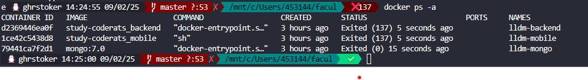

# App Mobile Flutter - Guia de Configuração para Desenvolvimento

Este guia irá te ajudar a configurar o ambiente de desenvolvimento do app mobile Flutter usando Docker no WSL. Isso garante consistência de desenvolvimento entre todos os membros da equipe.

## Pré-requisitos

Antes de começar, certifique-se de ter o seguinte instalado no seu sistema:

### Software Obrigatório

1. **WSL2 com Ubuntu (Obrigatório para todos)**
   - Habilite o WSL2 no Windows
   - Instale Ubuntu (versão mais recente) da Microsoft Store
   - Configure o Ubuntu como distribuição padrão

2. **Docker (Instalar via WSL - Muito mais fácil!)**
   - **NÃO** baixe do site docker.com
   - Instale diretamente no WSL Ubuntu com os comandos abaixo

3. **Git**
   - Será instalado junto com as outras dependências no WSL

### Configuração Completa do WSL

Execute estes comandos **dentro do WSL Ubuntu** para instalar tudo que você precisa:

```bash
# Atualize o sistema
sudo apt-get update && sudo apt-get upgrade -y

# Instale Docker, Docker Compose e Git
sudo apt-get install -y docker.io docker-compose git

# Adicione seu usuário ao grupo docker (requer logout/login)
sudo usermod -aG docker $USER

# Inicie o serviço Docker
sudo service docker start

# Configure Docker para iniciar automaticamente
sudo systemctl enable docker

# Reinicie o WSL para aplicar as mudanças
exit
# Reabra o terminal WSL
```

**⚠️ IMPORTANTE**: Após executar os comandos acima, feche e reabra seu terminal WSL para que as mudanças tenham efeito.

### Verificar Instalação

Execute estes comandos **dentro do WSL Ubuntu** para verificar se tudo está correto:

```bash
docker --version
docker-compose --version
git --version
```

## Início Rápido

### 1. Navegue até o Diretório do App Mobile

```bash
cd apps/mobile
```

### 2. Opção A: Usando Docker Compose (Recomendado)

Do **diretório raiz do projeto** (study-coderats/), execute todos os serviços:

```bash
# Volte para a raiz do projeto
cd ../..

# Inicie todos os serviços (backend, mobile, database)
docker-compose up --build
```

**✅ Isso é normal!** Os containers estão rodando e mostrando logs. 

**Para usar o container mobile:**

1. **Abra um NOVO terminal WSL** (não feche o atual)
2. **Execute** para acessar o container do mobile:
```bash
docker exec -it coderats-mobile sh
```

3. **Dentro do container, execute:**
```bash
flutter run -d web-server --web-port=8080 --web-hostname=0.0.0.0
```

**Acesse seu app em:** <http://localhost:8080>

**Para parar os containers:** Pressione `Ctrl+C` no terminal original.

**Alternativa - Rodar em background (sem ver logs):**
```bash
# Rode os containers em background
docker-compose up -d --build

# Para acessar o container mobile
docker exec -it coderats-mobile sh

# Para ver logs se necessário
docker-compose logs -f mobile

# Para parar tudo
docker-compose down
```

### 2. Opção B: Executar Apenas o App Mobile

Se você quiser trabalhar apenas no app mobile:

```bash
# Certifique-se de estar no diretório apps/mobile
cd apps/mobile

# Construa a imagem Docker
docker build -t flutter-mobile-app .

# Execute o container
docker run -it --rm -p 8081:8080 flutter-mobile-app
```

**Acesse seu app em:** http://localhost:8081

## Fluxo de Desenvolvimento

### Dentro do Container

Uma vez que seu container estiver rodando, você terá acesso a um shell onde pode executar comandos Flutter:

```bash
# Verifique a instalação do Flutter
flutter doctor

# Veja o que está disponível
ls -la

# Baixe as dependências
flutter pub get

# Execute a versão web (recomendado para desenvolvimento)
flutter run -d web-server --web-port=8080 --web-hostname=0.0.0.0
```

### Desenvolvimento ao Vivo

1. **Faça alterações no código** no seu diretório local `apps/mobile`
2. **Arquivos são sincronizados automaticamente** para o container via volume mounting
3. **Hot reload** funciona quando executando `flutter run`
4. **Veja as mudanças instantaneamente** no seu navegador

### Comandos Flutter Disponíveis

```bash
# Desenvolvimento
flutter run -d web-server --web-port=8080 --web-hostname=0.0.0.0
flutter hot-reload  # Pressione 'r' durante flutter run
flutter hot-restart # Pressione 'R' durante flutter run

# Testes
flutter test

# Análise
flutter analyze
flutter doctor

# Dependências
flutter pub get
flutter pub upgrade
flutter pub deps

# Build
flutter build web
flutter build linux
```

## Estrutura do Projeto

```
apps/mobile/
├── android/              # Arquivos específicos do Android
├── ios/                  # Arquivos específicos do iOS
├── lib/                  # Código fonte Flutter
│   └── main.dart        # Ponto de entrada do app
├── web/                  # Arquivos específicos da web
├── test/                 # Arquivos de teste
├── pubspec.yaml          # Dependências do Flutter
├── Dockerfile            # Configuração do container
└── README.md            # Este arquivo
```

## Solução de Problemas

### Problemas Comuns

1. **Erro 'ContainerConfig' no docker-compose**
   ```bash
   # Limpe containers e imagens antigas
   docker-compose down --volumes --remove-orphans
   docker system prune -a -f
   
   # Reconstrua tudo do zero
   docker-compose up --build --force-recreate
   ```

2. **Porta já em uso (8080)**
   ```bash
   # Use uma porta diferente
   docker run -it --rm -p 8081:8080 flutter-mobile-app
   ```

3. **Erros de permissão (WSL)**
   ```bash
   # Adicione usuário ao grupo docker
   sudo usermod -aG docker $USER
   # Depois faça logout e login novamente no WSL
   ```

4. **Docker não está rodando no WSL**
   ```bash
   # Inicie o serviço Docker
   sudo service docker start
   
   # Verifique se está rodando
   sudo service docker status
   ```

5. **Flutter doctor mostra avisos**
   ```
   [!] Flutter (Channel unknown, 3.7.7, ...)  ← Normal em container
   [✗] Chrome - develop for the web (...)     ← Normal em container
   [!] Android toolchain (...)                ← Normal em container
   [✓] Linux toolchain ← IMPORTANTE: Deve estar ✓
   [✓] HTTP Host Availability ← IMPORTANTE: Deve estar ✓
   ```
   - Avisos sobre Android/Chrome são normais em containers
   - Foque no Linux toolchain e HTTP availability estarem ✓

6. **Container não atualiza após mudanças no código**
   ```bash
   # Reconstrua sem cache
   docker build -t flutter-mobile-app . --no-cache
   ```

7. **Falha ao executar Chrome no container**
   ```bash
   # Use web-server ao invés de chrome
   flutter run -d web-server --web-port=8080 --web-hostname=0.0.0.0
   ```

### Comandos Docker Úteis

```bash
# Ver containers rodando
docker ps

# Parar container específico
docker stop coderats-mobile

# Ver logs
docker logs coderats-mobile

# Acessar shell do container
docker exec -it coderats-mobile sh

# Limpar imagens/containers não utilizados
docker system prune
```

## Dicas de Desenvolvimento

1. **Use modo web-server**: `flutter run -d web-server` é mais confiável que Chrome em containers
2. **Volume mounting funciona**: Suas mudanças locais aparecem imediatamente no container
3. **Hot reload**: Funciona perfeitamente para desenvolvimento rápido - pressione 'r' para recarregar
4. **Flexibilidade de porta**: Use portas diferentes (8081, 8082, etc.) para evitar conflitos
5. **Flutter doctor**: Ignore avisos sobre Android/Chrome no ambiente de container

## O que está Incluído no Container

✅ **Flutter SDK** (canal stable)  
✅ **Ferramentas de build Linux** (cmake, ninja-build, etc.)  
✅ **Google Chrome** (para desenvolvimento web)  
✅ **Display virtual** (Xvfb para operações headless)  
✅ **Todas as dependências** pré-instaladas  

## Saída Esperada do Flutter Doctor

Após a configuração, `flutter doctor` deve mostrar:
```
[✓] Flutter (Channel stable, 3.x.x, ...)
[!] Android toolchain (normal em container)
[✓] Chrome - develop for the web  
[✓] Linux toolchain - develop for Linux desktop
[✓] Connected device (1 available)
[✓] HTTP Host Availability
```

## Próximos Passos

1. **Inicie o container** usando um dos métodos acima
2. **Execute `flutter doctor`** para verificar a configuração
3. **Faça uma mudança de teste** em `lib/main.dart`
4. **Execute o app**: `flutter run -d web-server --web-port=8080 --web-hostname=0.0.0.0`
5. **Abra o navegador** em http://localhost:8080 (ou 8081)
6. **Veja suas mudanças ao vivo!**

## Desenvolvimento em Equipe

- Cada desenvolvedor pode executar sua própria instância de container
- Use portas diferentes para evitar conflitos
- Mudanças no código são sincronizadas via volume mounts
- Não é necessário instalar Flutter localmente
- Ambiente consistente em todas as máquinas

## Suporte

Se você encontrar problemas:

1. **Verifique este README** para soluções comuns
2. **Confirme os pré-requisitos** estão instalados corretamente
3. **Tente reconstruir** com a flag `--no-cache`
4. **Verifique os logs do Docker** para mensagens de erro detalhadas
5. **Pergunte aos membros da equipe** que já configuraram o ambiente com sucesso

---

Feliz desenvolvimento Flutter! 🚀📱


CONTAINER ID   IMAGE                    COMMAND                  CREATED       STATUS                       PORTS     NAMES
d2369446ea0f   study-coderats_backend   "docker-entrypoint.s…"   3 hours ago   Exited (137) 5 seconds ago             coderats-backend
1ce42c5438d8   study-coderats_mobile    "sh"                     3 hours ago   Exited (137) 5 seconds ago             coderats-mobile
79441ca7f2d1   mongo:7.0                "docker-entrypoint.s…"   3 hours ago   Exited (0) 15 seconds ago              coderats-mongo

